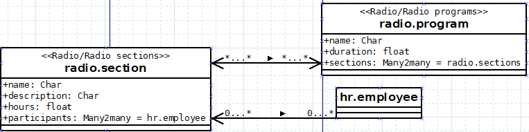
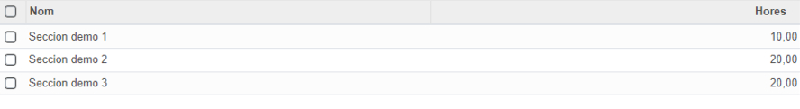
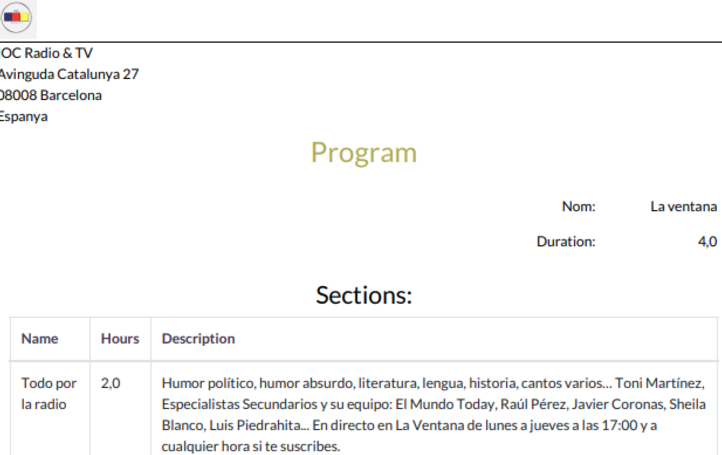

# 🎙️ Módulo de Radio para Odoo

Este repositorio contiene un módulo personalizado de Odoo.

## 📦 Descripción

El módulo `radio` permite gestionar programas de radio y sus secciones, así como asignar empleados a cada sección. Está diseñado para integrarse con el módulo de Recursos Humanos de Odoo (`hr.employee`).

### Funcionalidades principales

- Gestión de **secciones de radio** con nombre, descripción, duración y participantes.
- Creación de **programas de radio** compuestos por múltiples secciones.
- Cálculo automático de la duración total de un programa en función de las horas de sus secciones.
- Relación **Many2many** con empleados del módulo de RRHH.

## 🛠️ Estructura de relaciones del módulo

## 🖼️ Capturas de pantalla

## Vista general de secciones

### Vista en diferentes idiomas (Español y Catalán)

### Vista interior de sección

